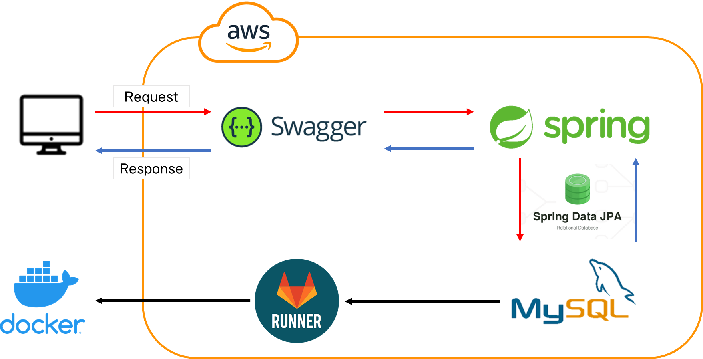
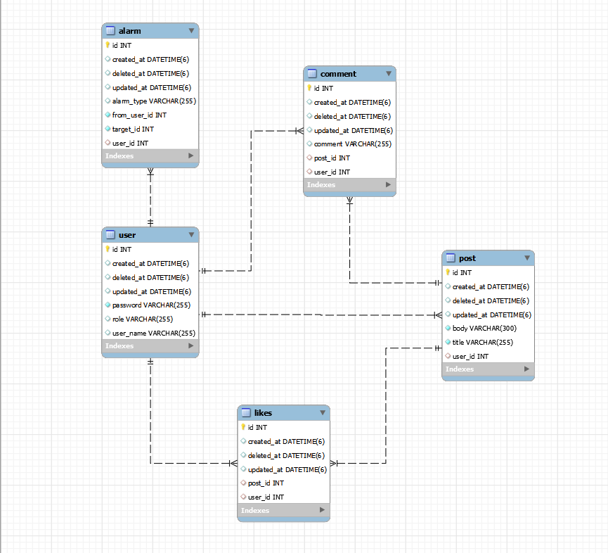

# SNS PROJECT

## Project Introduction

멋쟁이사자처럼 개인 종합 프로젝트로, SNS Project 입니다. MutsaSNS는 회원(회원가입, 로그인), 게시글(포스트) CRUD, 댓글 CRUD, 좋아요 기능, 알림 기능을 담고 있습니다.

 

👉 [프로젝트 Notion](https://www.notion.so/MutsaSNS-39729ab4eea043fda069d4938c8c278d)

 

 

## Project Install

Environment Variable에 아래의 값들을 설정하고 실행

|        환경변수 명         |                  입력 형식                  |
| :------------------------: | :-----------------------------------------: |
|   SPRING_DATASOURCE_URL    | jdbc:mysql://ec2서버url:3306/원하는Schema명 |
| SPRING_DATASOURCE_USERNAME |                    root                     |
| SPRING_DATASOURCE_PASSWORD |                    root                     |
|      JWT_TOKEN_SECRET      |              원하는 JWT 토큰명              |

 

 

## Swagger

도메인 적용 : http://soyeong.cloud:8080/swagger-ui/

ec2 (퍼블릭 IPv4 DNS) : http://ec2-43-201-32-133.ap-northeast-2.compute.amazonaws.com:8080/swagger-ui/

 

 

## Service Architecture

 

 

## ERD

 

 

## 미션 요구사항 분석 체크리스트

**[필수 과제]**

- [x] GitLab CI/CD를 이용한 Docker 자동 배포 
- [x] Swagger 적용
- [x] 회원가입
- [x] 로그인
- [x] 포스트 CRUD
- [x] 댓글 CRUD
- [x] 좋아요 등록 및 취소
- [x] 좋아요 수 조회
- [x] 마이피드 조회
- [x] 알람 등록
- [x] 알람 조회

 

**[도전 과제]**

- [ ] 화면 UI 구현하기

- [x] ADMIN 회원의 권한 변경 기능

- [x] ADMIN 회원일 경우 자신이 작성한 글 또는 댓글의 수정 삭제가 가능

  👉 ADMIN 계정 (userName: userName, password: 12345678)

 

 

## 미션 요약

👉 [1주차 미션 요약 보기](./note/1주차미션요약.md)

👉 [2주차 미션 요약 보기](./note/2주차미션요약.md)

## Endpoint

👉 [Endpoint](https://www.notion.so/EndPoint-49d3a4c127884c73aaba5eb1ea0cda06)

## ErrorCode

👉 [ErrorCode](https://www.notion.so/ed7f69aa573f468385c1cddbdb525885)
