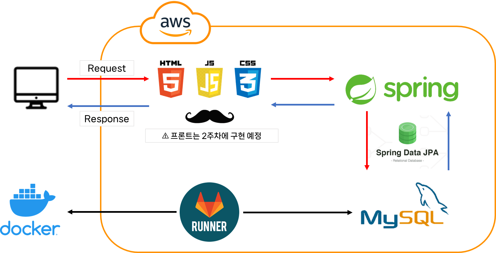
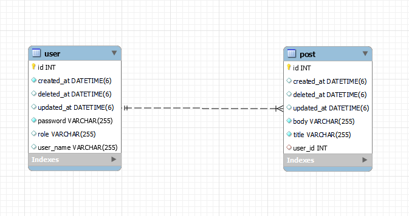

# SNS PROJECT

## Project Introduction

멋쟁이 사자처럼 최종 프로젝트로, SNS 개발을 위한 프로젝트 입니다.

<br />

## Swagger

도메인 적용 : http://soyeong.cloud:8080/swagger-ui/

ec2 (퍼블릭 IPv4 DNS) : http://ec2-43-201-32-133.ap-northeast-2.compute.amazonaws.com:8080/swagger-ui/

<br />

## Service Architecture

!(./assets/image-20221227181107062.png)



<br />

<br />

## ERD



<br />

<br />

## 미션 요구사항 분석 체크리스트

**[필수 과제]**

- [x] GitLab CI/CD를 이용한 Docker 자동 배포 
- [x] 회원가입
- [x] 로그인
- [x] 포스트 CRUD

<br />

**[도전 과제]**

- [ ] 화면 UI 구현하기

- [x] ADMIN 회원의 권한 변경 기능

- [x] ADMIN 회원일 경우 자신이 작성한 글 또는 댓글의 수정 삭제가 가능

  👉 ADMIN 계정 (userName: Soyeong, password: 12345)

<br />

<br />

### 1주차 미션 요약

------

**[접근 방법]**

#### 1️⃣ 회원가입 & 로그인

👉 [구현 내용](./note/회원가입&로그인.md)

<br />

#### 2️⃣ 포스트 CRUD

👉  [구현 내용](./note/포스트CRUD.md)

<br />

#### 3️⃣ 회원 권한 수정

- `@Secured` 와 `@EnableGlobalMethodSecurity(securedEnabled = true)` 를 적용함으로써 `ADMIN` 권한을 가지고 있는 User만 접근 가능
- 혹시 모를 예외에 대비하여 Service에서도 현재 로그인한 User의 권한이 `ADMIN` 인지 확인하는 예외 처리를 추가로 진행 
- `USER` 권한을 가진 회원이 접근 시 `403 Error` 가 발생하여 이를 ErrorCode에 추가하였으나 예외처리는 아직 하지 못함😢

<br />

**[특이사항]**

- 더 깔끔한 코드를 작성할 수도 있었을 것 같은데 기능의 작동을 먼저 생각하다보니 코드가 조금 지저분해진 것 같음 
- 8️⃣ 회원 권한 수정 시 `USER` 권한을 가진 회원이 접근했을 때 발생하는 **`403 Error`에 대한 예외처리**를 하지 못한 점이 아쉬움
- `@Secured` 외에도 사용자의 **접근 권한에 대해 설정하는 Security 관련 어노테이션**에 대해 학습이 더 필요
- JPA의 **Dirty Check (변경 감지)** 에 대해 이번 개발을 진행하며 처음 알게 되어 추가로 학습을 할 예정
- **프론트엔드**를 추가하지 못한 점이 아쉬움

<br />

**[참고한 자료 및  소스 코드]**

- [Git] 이전에 학습했던 Git과 정리 내용 : https://github.com/Soyeong4250/spring-security-exercise
- [도서] 스프링 부트 핵심 가이드
- [도서] 자바 ORM 표준 JPA 프로그래밍

<br />

<br />

## Endpoint

**[User]**

1️⃣ 회원가입

`POST /api/v1/users/join`

Request Body

```json
{
  "password": "string",
  "userName": "string"
}
```

Response Body

```json
{
  "result": {
    "userId": int,
    "userName": "string"
  },
  "resultCode": "string"
}
```

<br />

2️⃣ 로그인

`POST /api/v1/users/login`

Request Body

```json
{
  "password": "string",
  "userName": "string"
}
```

Response Body

```json
{
  "result": {
    "jwt": "string"
  },
  "resultCode": "string"
}
```

<br />

3️⃣ 권한 수정 

`POST /api/v1/users/{userId}/role/change`

⚠ Admin만 가능

Request Body

```json
{
  "role": "string(Enum)"
}
```

Response Body

```json
{
  "result": {
    "message": "string",
    "role": "string(Enum)"
  },
  "resultCode": "string"
}
```

<br />

**[Post]**

1️⃣ 포스트 등록

`POST /api/v1/posts`

Request Body

```json
{
  "body": "string",
  "title": "string"
}
```

Response Body

```JSON
{
  "result": {
    "message": "string",
    "postId": int
  },
  "resultCode": "string"
}
```

<br />

2️⃣ 포스트 상세 조회

`GET /api/v1/posts/{id}`

Response Body

```json
{
  "result": {
    "body": "string",
    "createdAt": "string",
    "id": int,
    "lastModifiedAt": "string",
    "title": "string",
    "userName": "string"
  },
  "resultCode": "string"
}
```

<br />

3️⃣ 포스트 목록 조회

`GET /api/v1/posts`

Response Body

```json
{
  "result": {
    "content": [
      {
        "body": "string",
        "createdAt": "string",
        "id": 0,
        "lastModifiedAt": "string",
        "title": "string",
        "userName": "string"
      }
    ],
    "empty": true,
    "first": true,
    "last": true,
    "number": 0,
    "numberOfElements": 0,
    "pageable": {
      "offset": 0,
      "pageNumber": 0,
      "pageSize": 0,
      "paged": true,
      "sort": {
        "empty": true,
        "sorted": true,
        "unsorted": true
      },
      "unpaged": true
    },
    "size": 0,
    "sort": {
      "empty": true,
      "sorted": true,
      "unsorted": true
    },
    "totalElements": 0,
    "totalPages": 0
  },
  "resultCode": "string"
}
```

<br />

4️⃣ 포스트 수정

`PUT /api/v1/posts/{id}`

Request Body

```json
{
  "body": "string",
  "title": "string"
}
```

Response Body

```json
{
  "result": {
    "message": "string",
    "postId": int
  },
  "resultCode": "string"
}
```

<br />

5️⃣ 포스트 삭제

`DELETE /api/v1/posts/{id}`

Response Body

```json
{
  "result": {
    "message": "string",
    "postId": int
  },
  "resultCode": "string"
}
```

